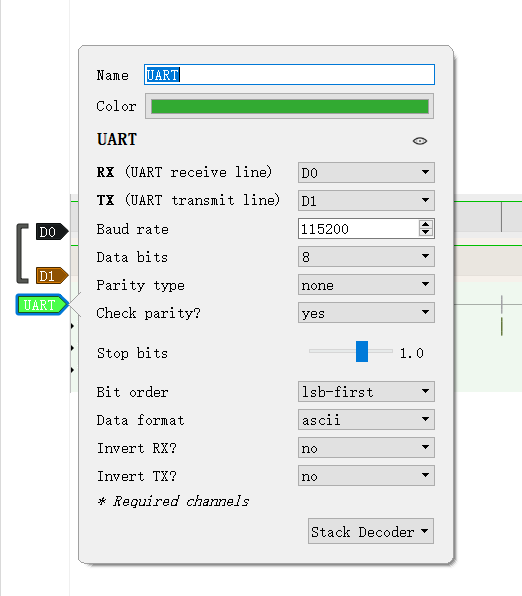
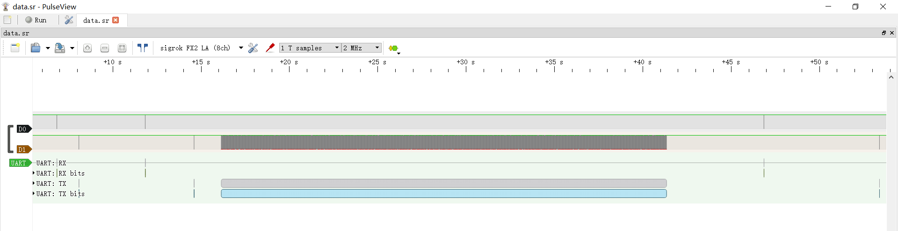
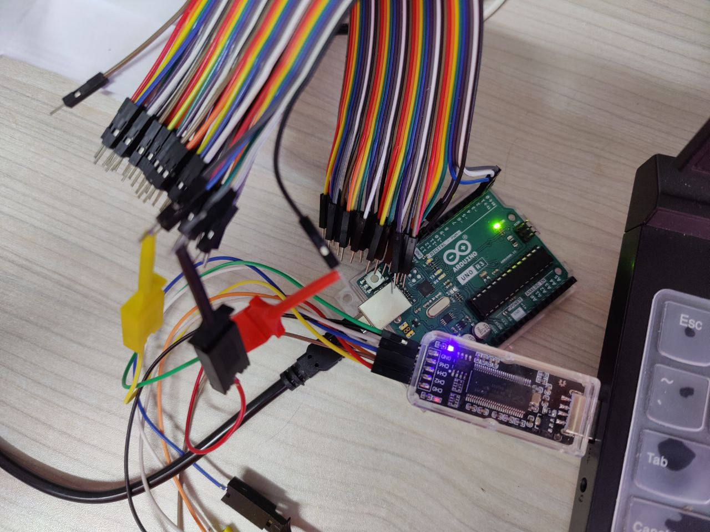

## Something In The Channel

又是熟悉的 TX、RX，怼上探针，让我听听他们在聊啥。

Hint: UART, 115200

附件在 `attachment` 文件夹下。


### flag

`tjctf{I_w4nt_T0_5hAr3_cu7e_C@ts_W17h_y0u}`


### writeup

这题其实是 2022 DASCTF X SU 三月春季赛 What'sInTheBits 题目的重制版，而且简化了很多，那道题也是咱出的哈哈。

根据题意，分析发现是 UART 信道里抓包得到的数据。

利用 PulseView 或者 sigrok cli 分析。

指定 UART 协议，波特率 115200，如图设置可以获得解析数据。





从而可以还原对话：

> - Hello! Do you want to go out with me to see the cats?
> - Hi, I'm sorry I can't go out because of the epidemic.
> - Sorry to hear that... Oh last time I forgot to tell you the first part of the flag. It should be `tjctf{I_w4nt_T0_5hAr3_`.
> - Great! I also have something to share with you, and maybe you like it.
> - (一段文件传输)
> - Well, I hope the epidemic will end as soon as possible. See you!
> - See you!

从中得到第一部分 flag： `tjctf{I_w4nt_T0_5hAr3_`

分析传输的文件，将中间部分导出，写个脚本解析一下，得到一个压缩包。

```python
"""
MiaoTony
"""

filename = 'file.txt'
data = ''
with open(filename, 'r', encoding='utf-8') as f:
    while True:
        line = f.readline()
        if not line:
            break
        # print(line)
        s = line.split('TX: ')[1]
        if s.startswith('Stop') or s.startswith('Start'):
            continue
        s = s[:-1]  # remove '\n'
        # print(line, s, len(s))
        if len(s) > 1 and s[0] == '[' and s[-1] == ']':
            s = s[1:-1]
        else:
            s = hex(ord(s))[2:].rjust(2, '0')
        # print(s)
        data += s

print(data)
file = bytes.fromhex(data)
with open('out.zip', 'wb') as f:
    f.write(file)
```

解压得到一张猫图，是可爱的 扑扑（一只嘉定校区里的猫猫的名字）。


在 blue0 层发现一个二维码，扫码得到第二部分 flag。


`cu7e_C@ts_W17h_y0u}`


### 彩蛋

出题的时候，临时在宿舍群里找了好兄弟借了个 arduino，再拿逻辑分析仪抓的信号，附一张实物图，哈哈。



希望大家玩得开心。