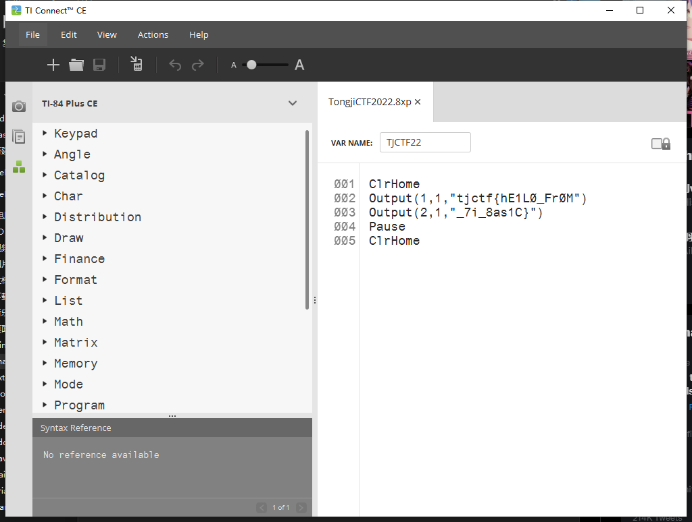
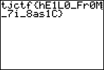

# basic

可以公开的信息：`TongjiCTF2022.vb` 为提供的文件，`description.txt` 是题目说明。

## Writeup

1. file

    ```bash
    > file ./TongjiCTF2022.vb
    ./TongjiCTF2022.vb: TI-83+ Graphing Calculator (program)
    ```

2. *可选* 修改名称为 `TongjiCTF2022.8xp`

3. 下载一个 TI Connect CE，打开就能知道 flag 为 `tjctf{hE1L0_Fr0M_7i_8as1C}`

    ```
    ClrHome
    Output(1,1,"tjctf{hE1L0_Fr0M")
    Output(2,1,"_7i_8as1C}")
    Pause 
    ClrHome
    ```

    


4. *可选* 连接上你的 TI-84 系列计算器跑一下

    
    
    