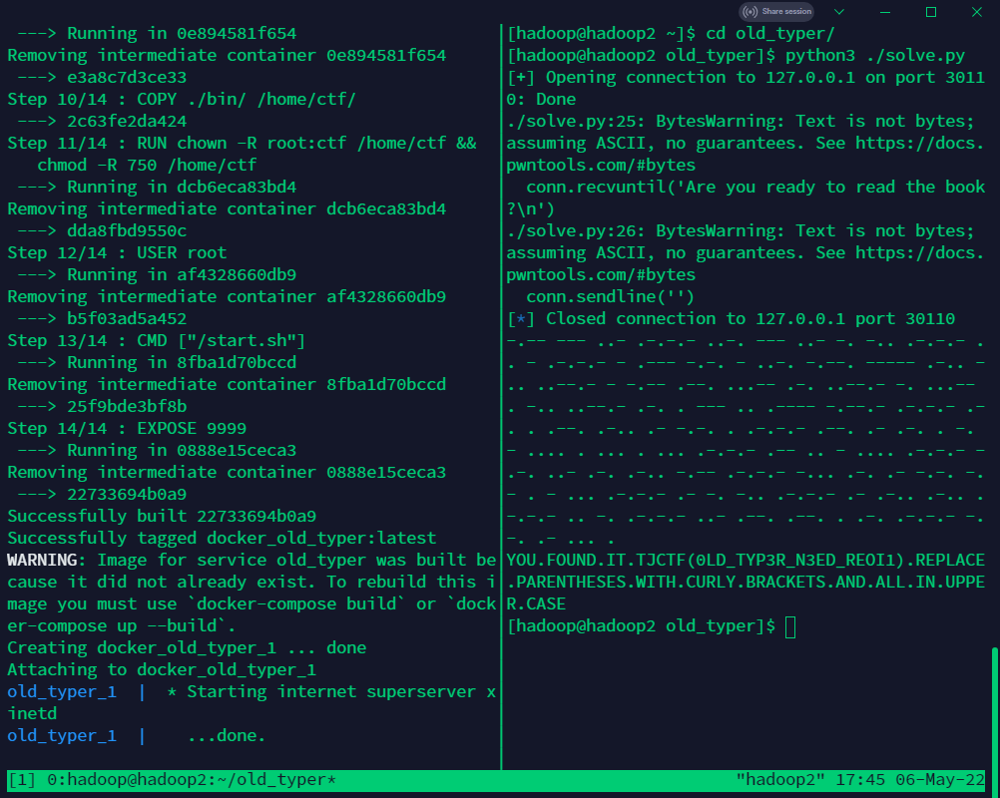

# Old Typer

可以公开的信息：`description.txt` 是题目说明。

## Writeup

1. nc 一下，发现每个字打出来的间隔是有规律的，有三种间隔

2. 猜出三种间隔分别是 滴 嗒 空格，应该是 morse

3. 编写脚本，得到结果 `YOU.FOUND.IT.TJCTF(0LD_TYP3R_N3ED_REOI1).REPLACE.PARENTHESES.WITH.CURLY.BRACKETS.AND.ALL.IN.UPPER.CASE`

    

4. flag 是 `tjctf{0Ld_TYP3R_n3eD_ReOI1}`