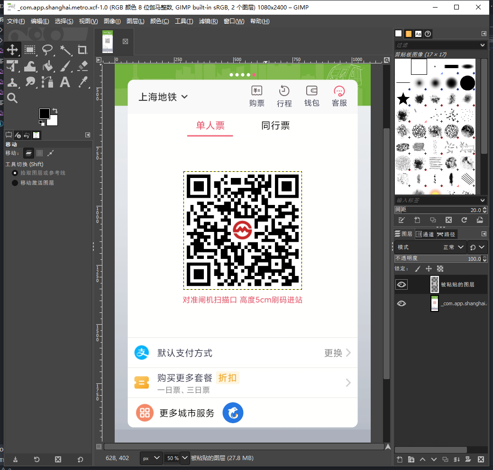
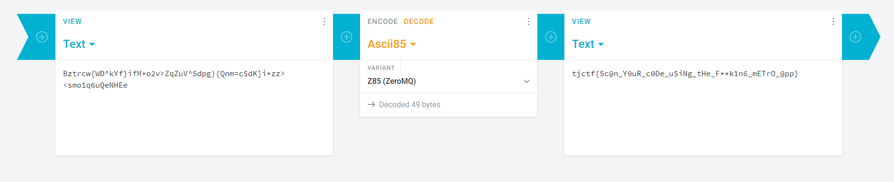

# 你码红了

可以公开的信息：`payload.png` 为提供的文件，`description.txt` 是题目说明。

## Writeup

1. binwalk

    ```bash
    > binwalk ./payload.png
    DECIMAL       HEXADECIMAL     DESCRIPTION
    --------------------------------------------------------------------------------
    0             0x0             PNG image, 1080 x 2400, 8-bit/color RGBA, non-interlaced
    64            0x40            Zlib compressed data, best compression
    6563          0x19A3          Zlib compressed data, default compression
    10374         0x2886          Zlib compressed data, best compression
    530944        0x81A00         POSIX tar archive (GNU), owner user name: ".shanghai.metro.xcf"
    ```

2. `binwalk -e ./payload.png` 得到 `shanghai.metro.xcf`

3. GIMP 打开，发现有两个图层

    

4. 隐藏上面一个图层，得到红🐎

5. 扫描红🐎，得到 `Bztrcw{WD^kYf}ifM*o2v>ZqZuV^Sdpg){Qnm=c$dK]i*zz><smo1q6uQeNHEe`

6. ascii85 解码得到 flag 为 `tjctf{Sc@n_Y0uR_c0De_u$iNg_tHe_F**k1n6_mETrO_@pp}`

    