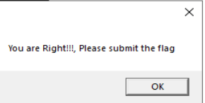

word打开之后显示应该启用内容，这里直接点击启用内容

word文字里面没什么重要的，就尝试查看宏，但是可能是未激活的原因，宏按钮是灰色的，就关闭

关闭的时候有个一闪而过的powershell窗口，这里就可以怀疑有问题了。

google搜索`office malware analysis tool`，不远处就有个oletools


安装好oletools，查看文档得知使用方式为`olevba <filename>`

得到如下输出

```txt
olevba 0.60 on Python 3.7.9 - http://decalage.info/python/oletools
===============================================================================
FILE: pre.doc
Type: OLE
-------------------------------------------------------------------------------
VBA MACRO ThisDocument.cls
in file: pre.doc - OLE stream: 'Macros/VBA/ThisDocument'
- - - - - - - - - - - - - - - - - - - - - - - - - - - - - - - - - - - - - - -
Private Function EncodeBase64(ByVal strData As String) As Byte()
    Dim objXML2 As MSXML2.DOMDocument
    Dim objNode As MSXML2.IXMLDOMElement
    Dim arrData() As Byte
    arrData = StrConv(strData, vbFromUnicode)
    '-------------------------------
    Set objXML2 = New MSXML2.DOMDocument
    Set objNode = objXML2.createElement("b64")
    '-------------------------------
    objNode.DataType = "bin.base64"
    objNode.nodeTypedValue = arrData
    '-------------------------------
    EncodeBase64 = objNode.Text
    '-------------------------------
    Set objNode = Nothing
    Set objXML2 = Nothing
End Function

Private Function DecodeBase64(ByVal strData As String) As Byte()
    Dim objXML2 As MSXML2.DOMDocument
    Dim objNode As MSXML2.IXMLDOMElement
    '-------------------------------
    Set objXML2 = New MSXML2.DOMDocument
    Set objNode = objXML2.createElement("b64")
    '-------------------------------
    objNode.DataType = "bin.base64"
    objNode.Text = strData
    '-------------------------------
    DecodeBase64 = StrConv(objNode.nodeTypedValue, vbUnicode)
    '-------------------------------
    Set objNode = Nothing
    Set objXML2 = Nothing
End Function
Function GenCode()
    s = "ZnVuY3Rpb24gbnVsbF9mdW5jKCRrZXkpewogICAgJHM9MC4uMjU1CiAgICAkaz0wLi4yNTUKICAgIGZvcmVhY2goJGkgaW4gMC4uMjU1KXsKICAgICAgICAka1skaV09W2ludF0ka2V5WyRpJSRrZXkuTGVuZ3RoXQogICAgfQogICAgJGo9MAogICAgZm9yZWFjaCgkaSBpbiAwLi4yNTUpewogICAgICAgICRqPSgkaiskc1skaV0rJGtbJGldKSUyNTYKICAgICAgICAkc1skaV0sJHNbJGpdPSRzWyRqXSwkc1skaV0KICAgIH0KICAgIHJldHVybiAkcwp9CmZ1bmN0aW9uIG51bGxfZnVuYzIoJHMsJGQpewogICAgJGksJGosJHQ9MCwwLDAKICAgIGZvcmVhY2goJGsgaW4gMC4uKCRkLkxlbmd0aC0xKSl7CiAgICAgICAgJGk9KCRpKzEpJTI1NgogICAgICAgICRqPSgkaiskc1skaV0pJTI1NgogICAgICAgICRzWyRpXSwkc1skal09JHNbJGpdLCRzWyRpXQogICAgICAgICR0PSgkc1skaV0rJHNbJGpdKzEpJTI1NgogICAgICAgICRkWyRrXT0kZFska10gLWJ4b3IgJHNbJHRdCiAgICB9CiAgICByZXR1cm4gJGQKfQpmdW5jdGlvbiBudWxsX2Z1bmMzKCRmKXsKICAgICRtPShbaW50XSRmWy0xXSsoW2ludF0kZlstMl0gLXNobCA4KSsoW2ludF0kZlstM10gLXNobCAxNikrKFtpbnRdJGZbLTRdIC1zaGwgMjQpKQoKICAgIGlmKCRtIC1lcSAweDQ0MzA0MzRkKXsKICAgICAgICAkbGVuPVtpbnRdJGZbLTVdKyhbaW50XSRmWy02XSAtc2hsIDgpKyhbaW50XSRmWy03XS1zaGwgMTYpKyhbaW50XSRmWy04XSAtc2hsIDI0KQogICAgICAg" & _
"ICRzPW51bGxfZnVuYyAiTjB0aGluZ190b19zZWUiCiAgICAgICAgcmV0dXJuIG51bGxfZnVuYzIgJHMgJGZbKC04LSRsZW4pLi4tOF0KICAgIH1lbHNlewogICAgICAgIHJldHVybiAkbnVsbAogICAgfQp9CmlmICggJGFyZ3MuQ291bnQgLWx0IDEgKSB7CiAgICBXcml0ZS1PdXRwdXQgImZsYWd7SSB0aGluayB5b3UgZG9uJ3QgbmVlZCB0aGlzIEZha2UgRmxhZ30iCiAgICBFeGl0Cn0KJHA9JGFyZ3NbMF0KJGY9W1N5c3RlbS5JTy5GaWxlXTo6UmVhZEFsbEJ5dGVzKCRwKQokZD1udWxsX2Z1bmMzICRmCmlmKCRudWxsIC1lcSAkZCl7CiAgICBXcml0ZS1PdXRwdXQgImZsYWd7Tm8gTmVlZCBmb3IgdGhpcyBmYWtlIGZsYWd9IgogICAgRXhpdAp9CiR0cGF0aD0kZW52OlRFTVArIlxQcm9ncmFtRmlsZXNcIgppZiAoKFRlc3QtUGF0aCAkdHBhdGgpIC1lcSAkZmFsc2UpewogICAgbWtkaXIgJHRwYXRoCn0KJHRmaWxlPSR0cGF0aCsiXFdpbmRvd3NVcGRhdGUuZGxsIgpbU3lzdGVtLklPLkZpbGVdOjpXcml0ZUFsbEJ5dGVzKCR0ZmlsZSwkZCkKSW1wb3J0LU1vZHVsZSAkdGZpbGUKJG09W0hlbGxvV29ybGRBcHBsaWNhdGlvbi5NYWluMV06Om5ldygpCmlmKCR0cnVlIC1lcSAkbS5kKCRlbnY6VVNFUlBST0ZJTEUpKXsKICAgIFtTeXN0ZW0uUmVmbGVjdGlvbi5Bc3NlbWJseV06OkxvYWRXaXRoUGFydGlhbE5hbWUoIlN5c3RlbS5XaW5kb3dzLkZvcm1zIikKICAgIFtTeXN0ZW0uV2luZG93cy5Gb3Jtcy5NZXNzYWdlQm94XTo6" & _
"c2hvdygiWW91IGFyZSBSaWdodCEhISwgUGxlYXNlIHN1Ym1pdCB0aGUgZmxhZyIpCn0="
    GenCode = DecodeBase64(s)
End Function
Function FsoWrite(str As String)
    Dim fso
    Target = Environ("Temp") & "\embeed114514times.txt.ps1"
    Set fso = CreateObject("Scripting.FileSystemObject")
    Set FileToCreate = fso.CreateTextFile(Target)
    FileToCreate.Write str
    FileToCreate.Close
    FsoWrite = Target
End Function
Sub run(cmd As String)
    Set WsShell = CreateObject("WScript.Shell")
    WsShell.run (cmd)
End Sub
Sub document_open()

End Sub
Sub document_close()
    cpath = ActiveDocument.FullName
    s = GenCode()
    FName = FsoWrite((s))
    run ("Powershell.exe -ExecutionPolicy ByPass -NoLogo -WindowStyle Hidden -command " & FName & " " & cpath) '
End Sub
Sub autoopen()
End Sub
+----------+--------------------+---------------------------------------------+
|Type      |Keyword             |Description                                  |
+----------+--------------------+---------------------------------------------+
|AutoExec  |autoopen            |Runs when the Word document is opened        |
|AutoExec  |document_close      |Runs when the Word document is closed        |
|AutoExec  |document_open       |Runs when the Word or Publisher document is  |
|          |                    |opened                                       |
|Suspicious|Environ             |May read system environment variables        |
|Suspicious|Write               |May write to a file (if combined with Open)  |
|Suspicious|CreateTextFile      |May create a text file                       |
|Suspicious|Shell               |May run an executable file or a system       |
|          |                    |command                                      |
|Suspicious|WScript.Shell       |May run an executable file or a system       |
|          |                    |command                                      |
|Suspicious|run                 |May run an executable file or a system       |
|          |                    |command                                      |
|Suspicious|Powershell          |May run PowerShell commands                  |
|Suspicious|ExecutionPolicy     |May run PowerShell commands                  |
|Suspicious|command             |May run PowerShell commands                  |
|Suspicious|CreateObject        |May create an OLE object                     |
|Suspicious|Output              |May write to a file (if combined with Open)  |
|          |                    |(obfuscation: Base64)                        |
|Suspicious|mkdir               |May create a directory (obfuscation: Base64) |
|Suspicious|Windows             |May enumerate application windows (if        |
|          |                    |combined with Shell.Application object)      |
|          |                    |(obfuscation: Base64)                        |
|Suspicious|System              |May run an executable file or a system       |
|          |                    |command on a Mac (if combined with           |
|          |                    |libc.dylib) (obfuscation: Base64)            |
|Suspicious|Hex Strings         |Hex-encoded strings were detected, may be    |
|          |                    |used to obfuscate strings (option --decode to|
|          |                    |see all)                                     |
|Suspicious|Base64 Strings      |Base64-encoded strings were detected, may be |
|          |                    |used to obfuscate strings (option --decode to|
|          |                    |see all)                                     |
|IOC       |txt.ps1             |Executable file name                         |
|IOC       |Powershell.exe      |Executable file name                         |
|IOC       |WindowsUpdate.dll   |Executable file name (obfuscation: Base64)   |
|Base64    |function            |ZnVuY3Rpb24gbnVsbF9mdW5jKCRrZXkpewogICAgJHM9M|
|String    |null_func($key){    |C4uMjU1CiAgICAkaz0wLi4yNTUKICAgIGZvcmVhY2goJG|
|          |    $s=0..255       |kgaW4gMC4uMjU1KXsKICAgICAgICAka1skaV09W2ludF0|
|          |    $k=0..255       |ka2V5WyRpJSRrZXkuTGVuZ3RoXQogICAgfQogICAgJGo9|
|          |    foreach($i in   |MAogICAgZm9yZWFjaCgkaSBpbiAwLi4yNTUpewogICAgI|
|          |0..255){            |CAgICRqPSgkaiskc1skaV0rJGtbJGldKSUyNTYKICAgIC|
|          |        $k[$i]=[int]|AgICAkc1skaV0sJHNbJGpdPSRzWyRqXSwkc1skaV0KICA|
|          |$key[$i%$key.Length]|gIH0KICAgIHJldHVybiAkcwp9CmZ1bmN0aW9uIG51bGxf|
|          |    }               |ZnVuYzIoJHMsJGQpewogICAgJGksJGosJHQ9MCwwLDAKI|
|          |    $j=0            |CAgIGZvcmVhY2goJGsgaW4gMC4uKCRkLkxlbmd0aC0xKS|
|          |    foreach($i in   |l7CiAgICAgICAgJGk9KCRpKzEpJTI1NgogICAgICAgICR|
|          |0..255){            |qPSgkaiskc1skaV0pJTI1NgogICAgICAgICRzWyRpXSwk|
|          |        $j=($j+$s[$i|c1skal09JHNbJGpdLCRzWyRpXQogICAgICAgICR0PSgkc|
|          |]+$k[$i])%256       |1skaV0rJHNbJGpdKzEpJTI1NgogICAgICAgICRkWyRrXT|
|          |        $s[$i],$s[$j|0kZFska10gLWJ4b3IgJHNbJHRdCiAgICB9CiAgICByZXR|
|          |]=$s[$j],$s[$i]     |1cm4gJGQKfQpmdW5jdGlvbiBudWxsX2Z1bmMzKCRmKXsK|
|          |    }               |ICAgICRtPShbaW50XSRmWy0xXSsoW2ludF0kZlstMl0gL|
|          |    return $s       |XNobCA4KSsoW2ludF0kZlstM10gLXNobCAxNikrKFtpbn|
|          |}                   |RdJGZbLTRdIC1zaGwgMjQpKQoKICAgIGlmKCRtIC1lcSA|
|          |function            |weDQ0MzA0MzRkKXsKICAgICAgICAkbGVuPVtpbnRdJGZb|
|          |null_func2($s,$d){  |LTVdKyhbaW50XSRmWy02XSAtc2hsIDgpKyhbaW50XSRmW|
|          |    $i,$j,$t=0,0,0  |y03XS1zaGwgMTYpKyhbaW50XSRmWy04XSAtc2hsIDI0KQ|
|          |    foreach($k in   |ogICAgICAg                                   |
|          |0..($d.Length-1)){  |                                             |
|          |$i=($i+1)%256       |                                             |
|          |$j=($j+$s[$i])%256  |                                             |
|          |        $s[$i],$s[$j|                                             |
|          |]=$s[$j],$s[$i]     |                                             |
|          |        $t=($s[$i]+$|                                             |
|          |s[$j]+1)%256        |                                             |
|          |$d[$k]=$d[$k] -bxor |                                             |
|          |$s[$t]              |                                             |
|          |    }               |                                             |
|          |    return $d       |                                             |
|          |}                   |                                             |
|          |function            |                                             |
|          |null_func3($f){     |                                             |
|          |    $m=([int]$f[-1]+|                                             |
|          |([int]$f[-2] -shl   |                                             |
|          |8)+([int]$f[-3] -shl|                                             |
|          |16)+([int]$f[-4]    |                                             |
|          |-shl 24))           |                                             |
|          |    if($m -eq       |                                             |
|          |0x4430434d){        |                                             |
|          |        $len=[int]$f|                                             |
|          |[-5]+([int]$f[-6]   |                                             |
|          |-shl                |                                             |
|          |8)+([int]$f[-7]-shl |                                             |
|          |16)+([int]$f[-8]    |                                             |
|          |-shl 24)            |                                             |
|Base64    | $s=null_func       |ICRzPW51bGxfZnVuYyAiTjB0aGluZ190b19zZWUiCiAgI|
|String    |"N0thing_to_see"    |CAgICAgcmV0dXJuIG51bGxfZnVuYzIgJHMgJGZbKC04LS|
|          |        return      |RsZW4pLi4tOF0KICAgIH1lbHNlewogICAgICAgIHJldHV|
|          |null_func2 $s       |ybiAkbnVsbAogICAgfQp9CmlmICggJGFyZ3MuQ291bnQg|
|          |$f[(-8-$len)..-8]   |LWx0IDEgKSB7CiAgICBXcml0ZS1PdXRwdXQgImZsYWd7S|
|          |    }else{          |SB0aGluayB5b3UgZG9uJ3QgbmVlZCB0aGlzIEZha2UgRm|
|          |        return $null|xhZ30iCiAgICBFeGl0Cn0KJHA9JGFyZ3NbMF0KJGY9W1N|
|          |    }               |5c3RlbS5JTy5GaWxlXTo6UmVhZEFsbEJ5dGVzKCRwKQok|
|          |}                   |ZD1udWxsX2Z1bmMzICRmCmlmKCRudWxsIC1lcSAkZCl7C|
|          |if ( $args.Count -lt|iAgICBXcml0ZS1PdXRwdXQgImZsYWd7Tm8gTmVlZCBmb3|
|          |1 ) {               |IgdGhpcyBmYWtlIGZsYWd9IgogICAgRXhpdAp9CiR0cGF|
|          |    Write-Output    |0aD0kZW52OlRFTVArIlxQcm9ncmFtRmlsZXNcIgppZiAo|
|          |"flag{I think you   |KFRlc3QtUGF0aCAkdHBhdGgpIC1lcSAkZmFsc2UpewogI|
|          |don't need this Fake|CAgbWtkaXIgJHRwYXRoCn0KJHRmaWxlPSR0cGF0aCsiXF|
|          |Flag}"              |dpbmRvd3NVcGRhdGUuZGxsIgpbU3lzdGVtLklPLkZpbGV|
|          |    Exit            |dOjpXcml0ZUFsbEJ5dGVzKCR0ZmlsZSwkZCkKSW1wb3J0|
|          |}                   |LU1vZHVsZSAkdGZpbGUKJG09W0hlbGxvV29ybGRBcHBsa|
|          |$p=$args[0]         |WNhdGlvbi5NYWluMV06Om5ldygpCmlmKCR0cnVlIC1lcS|
|          |$f=[System.IO.File]:|AkbS5kKCRlbnY6VVNFUlBST0ZJTEUpKXsKICAgIFtTeXN|
|          |:ReadAllBytes($p)   |0ZW0uUmVmbGVjdGlvbi5Bc3NlbWJseV06OkxvYWRXaXRo|
|          |$d=null_func3 $f    |UGFydGlhbE5hbWUoIlN5c3RlbS5XaW5kb3dzLkZvcm1zI|
|          |if($null -eq $d){   |ikKICAgIFtTeXN0ZW0uV2luZG93cy5Gb3Jtcy5NZXNzYW|
|          |    Write-Output    |dlQm94XTo6                                   |
|          |"flag{No Need for   |                                             |
|          |this fake flag}"    |                                             |
|          |    Exit            |                                             |
|          |}                   |                                             |
|          |$tpath=$env:TEMP+"\P|                                             |
|          |rogramFiles\"       |                                             |
|          |if ((Test-Path      |                                             |
|          |$tpath) -eq $false){|                                             |
|          |    mkdir $tpath    |                                             |
|          |}                   |                                             |
|          |$tfile=$tpath+"\Wind|                                             |
|          |owsUpdate.dll"      |                                             |
|          |[System.IO.File]::Wr|                                             |
|          |iteAllBytes($tfile,$|                                             |
|          |d)                  |                                             |
|          |Import-Module $tfile|                                             |
|          |$m=[HelloWorldApplic|                                             |
|          |ation.Main1]::new() |                                             |
|          |if($true -eq $m.d($e|                                             |
|          |nv:USERPROFILE)){   |                                             |
|          |    [System.Reflecti|                                             |
|          |on.Assembly]::LoadWi|                                             |
|          |thPartialName("Syste|                                             |
|          |m.Windows.Forms")   |                                             |
|          |    [System.Windows.|                                             |
|          |Forms.MessageBox]:: |                                             |
|Base64    |show("You are       |c2hvdygiWW91IGFyZSBSaWdodCEhISwgUGxlYXNlIHN1Y|
|String    |Right!!!, Please    |m1pdCB0aGUgZmxhZyIpCn0=                      |
|          |submit the flag")   |                                             |
|          |}                   |                                             |
+----------+--------------------+---------------------------------------------+
```

可以看到都给我解密了，实际上读vba源码可以看到，就是解密了一个脚本然后以文件路径为参数运行

查看powershell脚本

```ps1
function null_func($key){
    $s=0..255
    $k=0..255
    foreach($i in 0..255){
        $k[$i]=[int]$key[$i%$key.Length]
    }
    $j=0
    foreach($i in 0..255){
        $j=($j+$s[$i]+$k[$i])%256
        $s[$i],$s[$j]=$s[$j],$s[$i]
    }
    return $s
}
function null_func2($s,$d){
    $i,$j,$t=0,0,0
    foreach($k in 0..($d.Length-1)){
        $i=($i+1)%256
        $j=($j+$s[$i])%256
        $s[$i],$s[$j]=$s[$j],$s[$i]
        $t=($s[$i]+$s[$j]+1)%256
        $d[$k]=$d[$k] -bxor $s[$t]
    }
    return $d
}
function null_func3($f){
    $m=([int]$f[-1]+([int]$f[-2] -shl 8)+([int]$f[-3] -shl 16)+([int]$f[-4] -shl 24))

    if($m -eq 0x4430434d){
        $len=[int]$f[-5]+([int]$f[-6] -shl 8)+([int]$f[-7]-shl 16)+([int]$f[-8] -shl 24)
        $s=null_func "N0thing_to_see"
        return null_func2 $s $f[(-8-$len)..-8]
    }else{
        return $null
    }
}
if ( $args.Count -lt 1 ) {
    Write-Output "flag{I think you don't need this Fake Flag}"
    Exit
}
$p=$args[0]
$f=[System.IO.File]::ReadAllBytes($p)
$d=null_func3 $f
if($null -eq $d){
    Write-Output "flag{No Need for this fake flag}"
    Exit
}
$tpath=$env:TEMP+"\ProgramFiles\"
if ((Test-Path $tpath) -eq $false){
    mkdir $tpath
}
$tfile=$tpath+"\WindowsUpdate.dll"
[System.IO.File]::WriteAllBytes($tfile,$d)
Import-Module $tfile
$m=[HelloWorldApplication.Main1]::new()
if($true -eq $m.d($env:USERPROFILE)){
    [System.Reflection.Assembly]::LoadWithPartialName("System.Windows.Forms")
    [System.Windows.Forms.MessageBox]::show("You are Right!!!, Please submit the flag")
}
```

就是从文件末尾开始读取一定数量的字节数，存储之后运行

最后分析payload

```cs
using System;
using System.IO;
using System.Security.Cryptography;
using System.Text;

namespace HelloWorldApplication
{
	// Token: 0x02000002 RID: 2
	public class Main1
	{
		// Token: 0x06000001 RID: 1 RVA: 0x00002050 File Offset: 0x00000250
		private bool c(string s)
		{
			byte[] bytes = Encoding.UTF8.GetBytes("not important k~");
			byte[] iv = new byte[]
			{
				222,
				173,
				190,
				239,
				1,
				1,
				4,
				5,
				1,
				4,
				1,
				9,
				1,
				9,
				130,
				130
			};
			byte[] bytes2 = Encoding.UTF8.GetBytes(s);
			bool result;
			using (RijndaelManaged rijndaelManaged = new RijndaelManaged())
			{
				rijndaelManaged.Key = bytes;
				rijndaelManaged.Mode = CipherMode.CBC;
				rijndaelManaged.Padding = PaddingMode.PKCS7;
				rijndaelManaged.IV = iv;
				ICryptoTransform cryptoTransform = rijndaelManaged.CreateEncryptor();
				byte[] array = cryptoTransform.TransformFinalBlock(bytes2, 0, bytes2.Length);
				for (int i = 0; i < this.t.Length; i++)
				{
					bool flag = this.t[i] != array[i];
					if (flag)
					{
						return false;
					}
				}
				result = true;
			}
			return result;
		}

		// Token: 0x06000002 RID: 2 RVA: 0x0000212C File Offset: 0x0000032C
		public bool d(string path)
		{
			try
			{
				using (StreamReader streamReader = new StreamReader(path + "\\.ssh\\id_rsa"))
				{
					string text = streamReader.ReadLine();
					bool flag = text != null;
					if (flag)
					{
						return this.c(text);
					}
					return false;
				}
			}
			catch (Exception ex)
			{
			}
			return false;
		}

		// Token: 0x06000003 RID: 3 RVA: 0x000021A0 File Offset: 0x000003A0
		private static void Main(string[] args)
		{
			Console.WriteLine("flag{Another fake flag~~~}");
		}

		// Token: 0x04000001 RID: 1
		private byte[] t = new byte[]
		{
			65,
			85,
			135,
			14,
			130,
			191,
			4,
			47,
			184,
			184,
			116,
			133,
			192,
			173,
			142,
			52,
			124,
			56,
			252,
			0,
			2,
			66,
			15,
			228,
			9,
			204,
			85,
			137,
			119,
			113,
			169,
			223,
			212,
			27,
			218,
			62,
			187,
			69,
			15,
			214,
			230,
			156,
			202,
			143,
			189,
			187,
			157,
			96
		};
	}
}
```

也就是读取`~/.ssh/id_rsa`后，AES加密后和目标比对，正确就是flag了。

```python
from Crypto.Cipher import AES

key=b'not important k~'
iv=bytes([222,173,190,239,1,1,4,5,1,4,1,9,1,9,130,130])
c=bytes([65,85,135,14,130,191,4,47,184,184,116,133,192,173,142,52,124,56,252,0,2,66,15,228,9,204,85,137,119,113,169,223,212,27,218,62,187,69,15,214,230,156,202,143,189,187,157,96])
aes=AES.new(key=key,iv=iv,mode=AES.MODE_CBC)
print(aes.decrypt(c))
# flag{A_ma1war3_w1ll_g3t_ur_s3cr3t_f1le}
```

flag{A_ma1war3_w1ll_g3t_ur_s3cr3t_f1le}



这道题取材于一次真实的病毒分析过程，中间做了很多简化。
